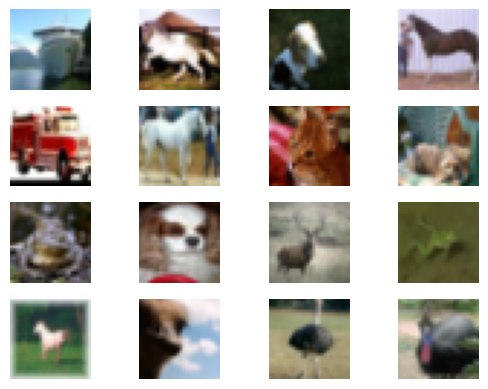

# An Implementation of the Diffusion Model in TensorFlow 2.0

This notebook contains an implementation of the diffusion model in TensorFlow 2.0. It has been developed as part of the [FIT3181 Deep Learning](https://handbook.monash.edu/2023/units/FIT3181?year=2023) unit at Monash University. The model is based on the paper Denoising Diffusion Probabilistic Models by [Ho et al. (2020)](https://arxiv.org/abs/2006.11239). The code is referenced from the Pytorch implementation by DeepFindr [here](https://youtu.be/a4Yfz2FxXiY?si=4E1Pz6yeg1Lhto8E)

## Investigating on the data

We will use the CIFAR10 dataset in this demo, with 50k training images. To get better performance, you might want to try with higher resolution datasets which can be found in [https://www.tensorflow.org/datasets/catalog/overview#all_datasets](https://www.tensorflow.org/datasets/catalog/overview#all_datasets).


```python
import tensorflow as tf
import tensorflow_datasets as tfds
import matplotlib.pyplot as plt


DATASET = 'cifar10'
IMG_SIZE = 28
BATCH_SIZE = 128

def show_images(dataset, num_samples=20, cols=4):
    """ Plots some samples from the dataset """
    plt.figure(figsize=(15, 15))
    for i, example in enumerate(dataset.take(num_samples)):
        if i == num_samples:
            break
        plt.subplot(num_samples // cols + 1, cols, i + 1)
        plt.imshow(example['image'].numpy().astype('uint8'))
        plt.axis('off')

# Load the dataset from TensorFlow Datasets
data, info = tfds.load(DATASET, with_info=True, as_supervised=False, data_dir='.')
dataset = data['train']

show_images(dataset)
plt.show()
```

    Downloading and preparing dataset 162.17 MiB (download: 162.17 MiB, generated: 132.40 MiB, total: 294.58 MiB) to ./cifar10/3.0.2...


    Dl Completed...: 0 url [00:00, ? url/s]


    Dl Size...: 0 MiB [00:00, ? MiB/s]


    Extraction completed...: 0 file [00:00, ? file/s]


    Generating splits...:   0%|          | 0/2 [00:00<?, ? splits/s]


    Generating train examples...:   0%|          | 0/50000 [00:00<?, ? examples/s]


    Shuffling cifar10/3.0.2.incompleteT4PJID/cifar10-train.tfrecord*...:   0%|          | 0/50000 [00:00<?, ? exam…


    Generating test examples...:   0%|          | 0/10000 [00:00<?, ? examples/s]


    Shuffling cifar10/3.0.2.incompleteT4PJID/cifar10-test.tfrecord*...:   0%|          | 0/10000 [00:00<?, ? examp…


    Dataset cifar10 downloaded and prepared to ./cifar10/3.0.2. Subsequent calls will reuse this data.


    

    


Create a data loader with some preprocess functions such as resize, flipping and normalization.


```python
def load_transformed_dataset():
    def preprocess_image(image, label):
        # Resize, random horizontal flip, normalize to [-1, 1]
        image = tf.image.resize(image, (IMG_SIZE, IMG_SIZE))
        image = tf.image.random_flip_left_right(image)
        image = (tf.cast(image, tf.float32) / 127.5) - 1.0
        return image, label

    # Load the dataset using TensorFlow Datasets with as_supervised=True
    dataset, info = tfds.load(DATASET, with_info=True, data_dir='.', split='train+test', as_supervised=True)
    dataset = dataset.map(preprocess_image)

    return dataset

data = load_transformed_dataset()
data = data.batch(BATCH_SIZE, drop_remainder=True).shuffle(buffer_size=10000)

# To visualize a batch of images:
for image, label in data.take(1):
    for i in range(16):  # Display the first 16 images
        plt.subplot(4, 4, i + 1)
        plt.imshow((image[i].numpy() + 1) / 2)  # Scale to [0, 1]
        plt.axis('off')
    plt.show()
```


    

    


# Forward Diffusion Process

In the following code, we implement the foward diffusion process, i.e., given an input image $x_0$ and number of denoising steps T, we calculate sample at a specific time step $x_t$

$$x_t = \sqrt{\bar{\alpha}_t} x_0 + \sqrt{1 - \bar{\alpha}_t} \epsilon$$

where $\bar{\alpha}_t = \prod_{s=0}^t (1 - \beta_t)$.
We use a simple linear scheduler for $\beta_t = \frac{\beta_T-\beta_0}{T} t + \beta_0$

Because these parameters $\beta_t, \bar{\alpha}_t$ are constant regardless input $x_0$, therefore, can be pre-computed.
The posterior variance $\sigma_t$ is defined as

$$\sigma_t = \sqrt{\frac{\beta_t (1 - \bar{\alpha}_t)}{1 - \alpha_t}}$$

which can be pre-computed as well but will be used in the backward diffusion process.


```python
# import tensorflow as tf

def linear_beta_schedule(timesteps, start=0.0001, end=0.02):
    return tf.linspace(start, end, timesteps)

def get_index_from_list(vals, t, x_shape):
    """
    Returns a specific index t of a passed list of values vals
    while considering the batch dimension.
    """
    batch_size = tf.shape(t)[0]
    t = tf.cast(t, dtype=tf.int32)
    out = tf.gather(vals, t, axis=-1)
    return tf.reshape(out, (batch_size,) + (1,) * (len(x_shape) - 1))

def forward_diffusion_sample(x_0, t, device="cpu"):
    """
    Takes an image and a timestep as input and
    returns the noisy version of it
    """
    noise = tf.random.normal(shape=tf.shape(x_0))
    sqrt_alphas_cumprod_t = get_index_from_list(sqrt_alphas_cumprod, t, tf.shape(x_0))
    sqrt_one_minus_alphas_cumprod_t = get_index_from_list(
        sqrt_one_minus_alphas_cumprod, t, tf.shape(x_0)
    )
    # mean + variance
    return sqrt_alphas_cumprod_t * x_0 + sqrt_one_minus_alphas_cumprod_t * noise, noise

# Define beta schedule
T = 300
betas = linear_beta_schedule(timesteps=T)

# Pre-calculate different terms for closed form
alphas = 1. - betas
alphas_cumprod = tf.math.cumprod(alphas, axis=0)
alphas_cumprod_prev = tf.pad(alphas_cumprod[:-1], [[1, 0]], constant_values=1.0)
sqrt_recip_alphas = tf.sqrt(1.0 / alphas)
sqrt_alphas_cumprod = tf.sqrt(alphas_cumprod)
sqrt_one_minus_alphas_cumprod = tf.sqrt(1. - alphas_cumprod)
posterior_variance = betas * (1. - alphas_cumprod_prev) / (1. - alphas_cumprod)
```


```python
def convert_tensor_image(image):
    # Reverse transformation
    image = (image + 1.0) / 2.0  # Scale to [0, 1]

    if image.shape.ndims == 4:
        image = image[0]  # Take the first image in the batch

    return image.numpy()
```

Showing the forward diffusion process.
The first row is the original image, and the second row is the denoised image at different time steps. You can see that the image becomes more and more noisy as the time step increases.


```python
import warnings
warnings.filterwarnings('ignore')
```


```python
import numpy as np
import warnings
warnings.filterwarnings("ignore")

# Simulate forward diffusion
image = next(iter(data))[0].numpy()

print(np.shape(image))

image = image[0]
num_images = 10


stepsize = int(T / num_images)

new_images = []

for idx in range(0, T, stepsize):
    t = tf.constant([idx], dtype=tf.int64)
    image, noise = forward_diffusion_sample(image, t)
    image_np = convert_tensor_image(image)
    new_images.append(image_np)

new_images = np.concatenate(new_images, axis=1)
plt.figure(figsize=(20, 20))
plt.imshow(new_images)
plt.axis('off')
```

    WARNING:matplotlib.image:Clipping input data to the valid range for imshow with RGB data ([0..1] for floats or [0..255] for integers).


    (128, 28, 28, 3)


    (-0.5, 279.5, 27.5, -0.5)


    

    


# Building an U-Net model

In diffusion model, the U-Net model is used as the denoiser $\epsilon_\theta(x_t, t)$ to denoise the image at each time step $x_t$.
The U-Net model is a encoder-decoder architecture with skip-connection. It also has a time embedding layer to embed the time step $t$ into the model by using the Sinusoidal Positional Encoding as in Transformer model.


```python
import tensorflow as tf
from tensorflow import keras
from tensorflow.keras import layers
import numpy as np
import math


# A simple Block used in U-Net.
# down: x -> Conv -> Relu -> BN ->
# down: time -> dense -> relu -> add -> Conv -> relu -> BN -> transform

class Block(layers.Layer):
    def __init__(self, in_ch, out_ch, time_emb_dim, up=False):
        super(Block, self).__init__()
        self.time_mlp = layers.Dense(out_ch)
        if up:
            self.conv1 = layers.Conv2D(out_ch, 3, padding='same')
            self.transform = layers.Conv2DTranspose(out_ch, 4, strides=2, padding='same')
        else:
            self.conv1 = layers.Conv2D(out_ch, 3, padding='same')
            self.transform = layers.Conv2D(out_ch, 4, strides=2, padding='same')
        self.conv2 = layers.Conv2D(out_ch, 3, padding='same')
        self.bnorm1 = layers.BatchNormalization()
        self.bnorm2 = layers.BatchNormalization()
        self.relu = layers.ReLU()

    def call(self, x, t):
        # First Conv
        h = self.bnorm1(self.relu(self.conv1(x)))
        # Time embedding
        time_emb = self.relu(self.time_mlp(t))
        # Extend last 2 dimensions
        time_emb = tf.expand_dims(time_emb, axis=1)
        time_emb = tf.expand_dims(time_emb, axis=1)

        # Add time channel
        h = h + time_emb
        # Second Conv
        h = self.bnorm2(self.relu(self.conv2(h)))
        # Down or Upsample
        return self.transform(h)

# Sinusoidal Position Embedding as used in Transformer
class SinusoidalPositionEmbeddings(layers.Layer):
    def __init__(self, dim):
        super(SinusoidalPositionEmbeddings, self).__init__()
        self.dim = dim

    def call(self, time):
        device = time.device
        time_float = tf.cast(time, dtype=tf.float32)
        half_dim = self.dim // 2
        embeddings = math.log(10000) / (half_dim - 1)
        embeddings = tf.exp(tf.range(half_dim, dtype=tf.float32) * (-embeddings))

        embeddings = time_float[:, None] * embeddings[None, :]
        # embeddings = time_float * embeddings[None, :]
        embeddings = tf.concat([tf.sin(embeddings), tf.cos(embeddings)], axis=-1)
        return embeddings

class SimpleUnet(keras.Model):
    def __init__(self):
        super(SimpleUnet, self).__init__()
        image_channels = 3
        if DATASET == 'stanford_dogs':
          down_channels = (IMG_SIZE, 128, 256, 512, 1024)
          up_channels = (1024, 512, 256, 128, IMG_SIZE)
        elif DATASET == 'cifar10':
          down_channels = (IMG_SIZE, 128, 256)
          up_channels = (256, 128, IMG_SIZE)
        out_dim = 1
        time_emb_dim = 32

        # Time embedding
        self.time_mlp = keras.Sequential([
            SinusoidalPositionEmbeddings(time_emb_dim),
            layers.Dense(time_emb_dim),
            layers.ReLU()
        ])

        # Initial projection
        self.conv0 = layers.Conv2D(down_channels[0], 3, padding='same')

        # Downsample
        self.downs = [Block(down_channels[i], down_channels[i+1], time_emb_dim) for i in range(len(down_channels)-1)]

        # Upsample
        self.ups = [Block(up_channels[i], up_channels[i+1], time_emb_dim, up=True) for i in range(len(up_channels)-1)]

        self.output_layer = layers.Conv2D(3, out_dim, padding='same')

    def call(self, x, timestep):
        # Embedd time
        t = self.time_mlp(timestep)
        # Initial conv
        x = self.conv0(x)
        # Unet
        residual_inputs = []
        for down in self.downs:
            x = down(x, t)
            residual_inputs.append(x)
        for up in self.ups:
            residual_x = residual_inputs.pop()
            # Add residual x as additional channels
            x = tf.concat([x, residual_x], axis=-1)
            x = up(x, t)
        return self.output_layer(x)

model = SimpleUnet()


```

# Objective function for training diffusion model

The objective function for training diffusion model is actually quite simple as we minimize the $L_2$ distance between the predicted noise and the ground truth noise.

$$L = \mathbb{E}_{x_0 \sim q(x_0), \epsilon \sim N(0,I)} \left[ \| \epsilon - \epsilon_\theta (x_t, t) \| \right]$$

where $\epsilon_\theta$ is the U-Net which predicts the noise at time step $t$ with input $x_t$


```python
def get_loss(model, x_0, t):
    x_noisy, noise = forward_diffusion_sample(x_0, t)
    noise_pred = model(x_noisy, t)
    return tf.reduce_mean(tf.abs(noise - noise_pred), axis=[1, 2, 3])
```

# Sample new images with Diffusion model

In the following, we implement the reverse diffusion process to sample new images from the trained model. The reverse diffusion process is defined as

$$x_{t-1} = \frac{1}{\sqrt{\alpha_t}} \left( x_t - \frac{1 - \alpha_t}{\sqrt{1 - \bar{\alpha}_t}} \epsilon_\theta(x_t, t) \right) + \sigma_t \epsilon$$

where $\alpha_t = 1 - \beta_t$ and $\bar{\alpha}_t = \prod_{s=0}^t (1 - \beta_s)$

The posterior variance $\sigma_t$ is defined as

$$\sigma_t = \sqrt{\frac{\beta_t (1 - \bar{\alpha}_t)}{1 - \alpha_t}}$$

which has been pre-computed in the forward diffusion process


```python

@tf.function
def sample_timestep(x, t, model, betas, sqrt_one_minus_alphas_cumprod, sqrt_recip_alphas, posterior_variance):
    """
    Calls the model to predict the noise in the image and returns
    the denoised image.
    Applies noise to this image if we are not in the last step yet.
    """
    betas_t = get_index_from_list(betas, t, x.shape)
    sqrt_one_minus_alphas_cumprod_t = get_index_from_list(sqrt_one_minus_alphas_cumprod, t, x.shape)
    sqrt_recip_alphas_t = get_index_from_list(sqrt_recip_alphas, t, x.shape)

    # Call model (current image - noise prediction)
    model_mean = sqrt_recip_alphas_t * (
        x - betas_t * model(x, t) / sqrt_one_minus_alphas_cumprod_t
    )
    posterior_variance_t = get_index_from_list(posterior_variance, t, x.shape)

    if t == 0:
        return model_mean
    else:
        noise = tf.random.normal(shape=tf.shape(x))
        return model_mean + tf.sqrt(posterior_variance_t) * noise

def sample_plot_image(model, betas, sqrt_one_minus_alphas_cumprod, sqrt_recip_alphas, posterior_variance, device, IMG_SIZE, T):
    # Sample noise
    img_size = IMG_SIZE
    img = tf.random.normal((1, img_size, img_size, 3), dtype=tf.float32)

    num_images = 10
    stepsize = int(T / num_images)

    new_images = []
    for i in range(T - 1, -1, -1):
        t = tf.constant([i], dtype=tf.int64)
        img = sample_timestep(img, t, model, betas, sqrt_one_minus_alphas_cumprod, sqrt_recip_alphas, posterior_variance)
        if i % stepsize == 0:
            img_np = convert_tensor_image(img)
            new_images.append(img_np)
    new_images = np.concatenate(new_images, axis=1)
    plt.figure(figsize=(20, 20))
    plt.imshow(new_images)
    plt.axis('off')
    plt.show()

def sample_plot_batch(model, betas, sqrt_one_minus_alphas_cumprod, sqrt_recip_alphas, posterior_variance, device, IMG_SIZE, T):
    # Sample noise
    batch_size = 10
    img_size = IMG_SIZE
    img = tf.random.normal((batch_size, img_size, img_size, 3), dtype=tf.float32)

    for i in range(T - 1, -1, -1):
        t = tf.constant([i], dtype=tf.int64)
        img = sample_timestep(img, t, model, betas, sqrt_one_minus_alphas_cumprod, sqrt_recip_alphas, posterior_variance)

    batch_images = img.numpy()
    batch_images = (batch_images + 1) / 2
    batch_images = np.reshape(batch_images, [img_size, img_size * batch_size, 3])
    plt.figure(figsize=(20, 20))
    plt.imshow(new_images)
    plt.axis('off')
    plt.show()

```

# Combine all together: Training and Sampling

In the following code, we combine all the above components together to train the diffusion model and sample new images along the training process. Note that, the training takes a long time to converge and start to generate good samples.


```python
import warnings
warnings.filterwarnings( "ignore", module = "matplotlib\..*" )
```


```python
# import tensorflow as tf

# Define device
device = "GPU" if tf.test.is_gpu_available() else "CPU"

# Move model to device (if not already)
model = SimpleUnet()  # Assuming SimpleUnet is your model

# Define optimizer
optimizer = tf.keras.optimizers.Adam(learning_rate=0.001)

# Define training parameters
epochs = 100  # Try more!
for epoch in range(epochs):
    for step, batch in enumerate(data):
        with tf.GradientTape() as tape:
            # Generate random time steps
            t = tf.random.uniform(shape=(BATCH_SIZE,), minval=0, maxval=T, dtype=tf.int64)

            # Forward pass and compute loss
            loss = tf.reduce_mean(get_loss(model, batch[0], t))

        # Compute gradients and update model
        grads = tape.gradient(loss, model.trainable_variables)
        optimizer.apply_gradients(zip(grads, model.trainable_variables))

        if epoch % 5 == 0 and step == 0:
            print(f"Epoch {epoch} | Step {step:03d} Loss: {loss.numpy()}")

            # Sample and plot an image
            sample_plot_image(model, betas, sqrt_one_minus_alphas_cumprod, sqrt_recip_alphas, posterior_variance, device, IMG_SIZE, T)

# Generate a batch of images at the end
sample_plot_batch(model, betas, sqrt_one_minus_alphas_cumprod, sqrt_recip_alphas, posterior_variance, device, IMG_SIZE, T)
```

    Epoch 0 | Step 000 Loss: 0.806877076625824


    WARNING:matplotlib.image:Clipping input data to the valid range for imshow with RGB data ([0..1] for floats or [0..255] for integers).


    

    


    Epoch 5 | Step 000 Loss: 0.21929287910461426


    WARNING:matplotlib.image:Clipping input data to the valid range for imshow with RGB data ([0..1] for floats or [0..255] for integers).


    

    


    Epoch 10 | Step 000 Loss: 0.18964025378227234


    WARNING:matplotlib.image:Clipping input data to the valid range for imshow with RGB data ([0..1] for floats or [0..255] for integers).


    

    


    Epoch 15 | Step 000 Loss: 0.18313837051391602


    WARNING:matplotlib.image:Clipping input data to the valid range for imshow with RGB data ([0..1] for floats or [0..255] for integers).


    

    


    Epoch 20 | Step 000 Loss: 0.19203712046146393


    WARNING:matplotlib.image:Clipping input data to the valid range for imshow with RGB data ([0..1] for floats or [0..255] for integers).


    

    


    Epoch 25 | Step 000 Loss: 0.17337192595005035


    WARNING:matplotlib.image:Clipping input data to the valid range for imshow with RGB data ([0..1] for floats or [0..255] for integers).


    

    


    Epoch 30 | Step 000 Loss: 0.1791364699602127


    WARNING:matplotlib.image:Clipping input data to the valid range for imshow with RGB data ([0..1] for floats or [0..255] for integers).


    

    


    Epoch 35 | Step 000 Loss: 0.1715242862701416


    WARNING:matplotlib.image:Clipping input data to the valid range for imshow with RGB data ([0..1] for floats or [0..255] for integers).


    

    


    Epoch 40 | Step 000 Loss: 0.1820080429315567


    WARNING:matplotlib.image:Clipping input data to the valid range for imshow with RGB data ([0..1] for floats or [0..255] for integers).


    

    


    Epoch 45 | Step 000 Loss: 0.16992542147636414


    WARNING:matplotlib.image:Clipping input data to the valid range for imshow with RGB data ([0..1] for floats or [0..255] for integers).


    

    


    Epoch 50 | Step 000 Loss: 0.17644020915031433


    WARNING:matplotlib.image:Clipping input data to the valid range for imshow with RGB data ([0..1] for floats or [0..255] for integers).


    

    


    Epoch 55 | Step 000 Loss: 0.16511115431785583


    WARNING:matplotlib.image:Clipping input data to the valid range for imshow with RGB data ([0..1] for floats or [0..255] for integers).


    

    


    Epoch 60 | Step 000 Loss: 0.1632281243801117


    WARNING:matplotlib.image:Clipping input data to the valid range for imshow with RGB data ([0..1] for floats or [0..255] for integers).


    

    


    Epoch 65 | Step 000 Loss: 0.16946107149124146


    WARNING:matplotlib.image:Clipping input data to the valid range for imshow with RGB data ([0..1] for floats or [0..255] for integers).


    

    


    Epoch 70 | Step 000 Loss: 0.17314471304416656


    WARNING:matplotlib.image:Clipping input data to the valid range for imshow with RGB data ([0..1] for floats or [0..255] for integers).


    

    


    Epoch 75 | Step 000 Loss: 0.16922444105148315


    WARNING:matplotlib.image:Clipping input data to the valid range for imshow with RGB data ([0..1] for floats or [0..255] for integers).


    

    


    Epoch 80 | Step 000 Loss: 0.1614874303340912


    WARNING:matplotlib.image:Clipping input data to the valid range for imshow with RGB data ([0..1] for floats or [0..255] for integers).


    

    


    Epoch 85 | Step 000 Loss: 0.1648266315460205


    WARNING:matplotlib.image:Clipping input data to the valid range for imshow with RGB data ([0..1] for floats or [0..255] for integers).


    

    


    Epoch 90 | Step 000 Loss: 0.16022856533527374


    WARNING:matplotlib.image:Clipping input data to the valid range for imshow with RGB data ([0..1] for floats or [0..255] for integers).


    

    


    Epoch 95 | Step 000 Loss: 0.17524562776088715


    WARNING:matplotlib.image:Clipping input data to the valid range for imshow with RGB data ([0..1] for floats or [0..255] for integers).


    

    


```python

```
